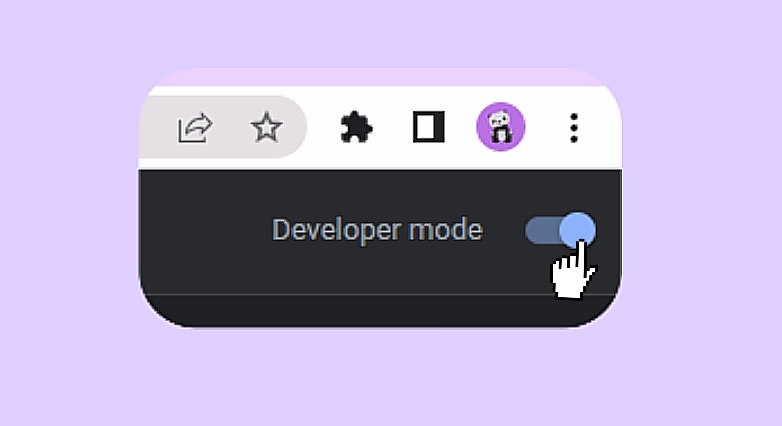

<h2 align="center">FirebaseElevate</h2>

    
 
 

FirebaseElevate is an <strong>open-source</strong> <strong>browser extension</strong> designed to up your Firebase console.  
  It allows you to create relations for your collections and easily navigate to related documents.

 

 

 

## How to contribute

First off, thanks for taking the time to contribute! ❤️

All types of contributions are encouraged and valued. Feel free to fork the codebase and make a pull request for your changes.

And if you like the project, but just don't have time to contribute, that's fine. There are other easy ways to support the project and show your appreciation, which we would also be very happy about:

- Star the project
- Tweet about it
- Refer this project in your project's readme
- Mention the project at local meetups and tell your friends/colleagues

The framework in use for extension:
<a href="https://github.com/PlasmoHQ/plasmo">PlasmoHQ</a>

 

<h1>System Requirement</h1>

- Node.js 16.x or later
   

<!-- ## How to start project -->
<h1>Development</h1>
If you want to contribute to this repository,  

* You need to first clone this repo using github desktop or rather fork.  

<pre style=" border-radius: 15px;"># clone your fork to your local machine 
https://github.com/edwardsmoses/firestore-extension.git
</pre>

<h1>Installation</h1>
Install Node.js

 * Tap <a href="https://nodejs.org/en/">nodejs</a> to download.

<h2>Building for use</h2>
Install <code>yarn.lock</code>.  Open the terminal <i>Command prompt</i> in the root folder to run:  
1. Install <code>yarn</code> 
2. Install the dependencies with:    

<pre class="notranslate" style=" border-radius: 12px;"><code>npm install --global yarn
</code>
The command will install Yarn globally on your system.
</pre>

3. Use to run   

<pre class="notranslate" style=" border-radius: 12px;"><code>yarn dev
</code></pre>

<h3>Yarn commands:</h3>

 * Yarn add [package]  - To add a package
 * Yarn install  - To install dependencies

 
<h1>Loading the Extension in Chrome</h2>
Head over to <code>chrome://extensions </code> and enable <strong>Developer Mode</strong>.
 
 

   

